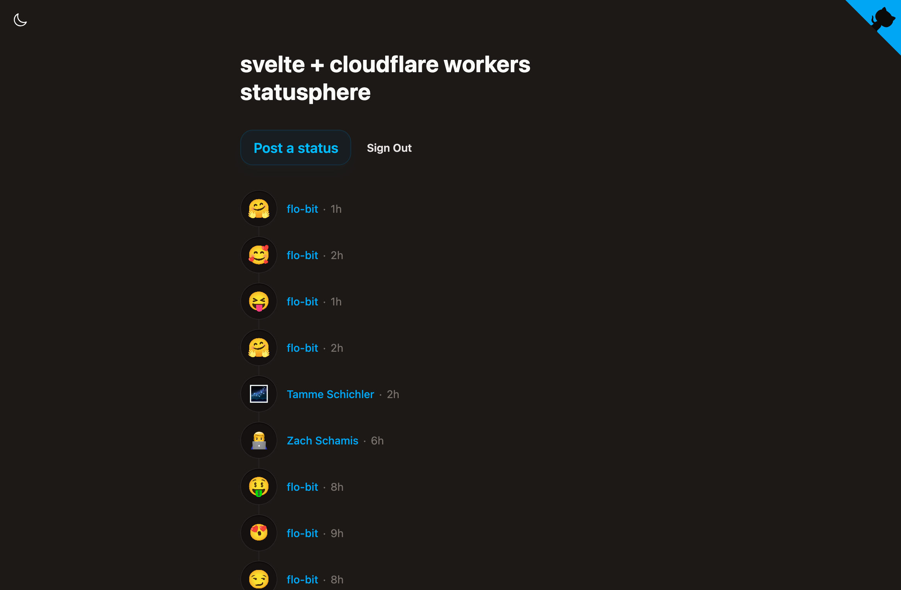

# svelte cloudflare statusphere

> **Work in progress**




**Demo:** https://statusphere.atmo.tools


svelte + cloudflare workers statusphere demo, built with lots of [`@atcute`](https://github.com/mary-ext/atcute) packages, [ufos.microcosm.blue](https://ufos.microcosm.blue/) (for recent status updates without its own backend), jetstream subscription for real-time updates and [@foxui](https://flo-bit.dev/ui-kit) for ui components.

also doubles as a demo of `@atcute/oauth-node-client` for server-side oauth flows in cloudflare workers, with session storage in KV and HMAC-signed cookies and lots of useful functions.

## Quick Start

```sh
pnpm install
pnpm dev
```

Dev mode uses a loopback oauth client — no keys or cloudflare setup needed. Open the URL shown in the terminal and log in with any Bluesky handle. (The port is randomized per project in case you're running multiple projects at one — set `src/lib/atproto/port.ts`.)

See [GETTING_STARTED.md](GETTING_STARTED.md) for production deployment, tunnel setup, and configuration.

## Adding the oauth part to an existing project

**With an AI agent** — paste this into Claude Code (or similar) in your existing repo:

```
add atproto oauth to this project https://raw.githubusercontent.com/flo-bit/svelte-cloudflare-statusphere/main/AGENT_SETUP.md
```

The [agent prompt](AGENT_SETUP.md) asks a few questions and sets everything up.

**Manually** — see [SETUP.md](SETUP.md) for a step-by-step guide.

## Project Structure

```
src/lib/atproto/
├── auth.svelte.ts          # Client-side auth state & login/logout/signup
├── image-helper.ts         # Image compression + upload helpers
├── index.ts                # Public exports
├── methods.ts              # AT Protocol helpers (read/write/resolve)
├── port.ts                 # Dev server port (randomized per project)
├── settings.ts             # Collections, scope, config constants
├── server/
│   ├── oauth.ts            # OAuthClient factory (loopback vs confidential)
│   ├── oauth.remote.ts     # Remote functions: login, logout
│   ├── repo.remote.ts      # Remote functions: putRecord, deleteRecord, uploadBlob
│   ├── session.ts          # Session restoration from signed cookie
│   ├── profile.ts          # Profile loading with optional KV cache
│   ├── kv-store.ts         # Cloudflare KV-backed Store
│   └── signed-cookie.ts    # HMAC-signed cookie helpers
└── scripts/
    ├── generate-key.ts
    ├── generate-secret.ts
    ├── setup-dev.ts
    └── tunnel.ts

src/routes/(oauth)/
├── oauth/callback/+server.ts
├── oauth/jwks.json/+server.ts
└── oauth-client-metadata.json/+server.ts
```

## How It Works

- **Auth**: Server-side OAuth via `@atcute/oauth-node-client`. Sessions stored in KV, identified by HMAC-signed `did` cookie.
- **Remote functions**: Write operations and auth actions use SvelteKit remote functions — type-safe server calls without manual API routes.
- **Dev mode**: Loopback client by default. Set `OAUTH_PUBLIC_URL` in `.env` for confidential client via tunnel.
- **Prod mode**: Confidential client with `private_key_jwt`, KV stores, `OAUTH_PUBLIC_URL` from `wrangler.jsonc`.

## License

MIT


## todo

- make typesafe (with lexicons)